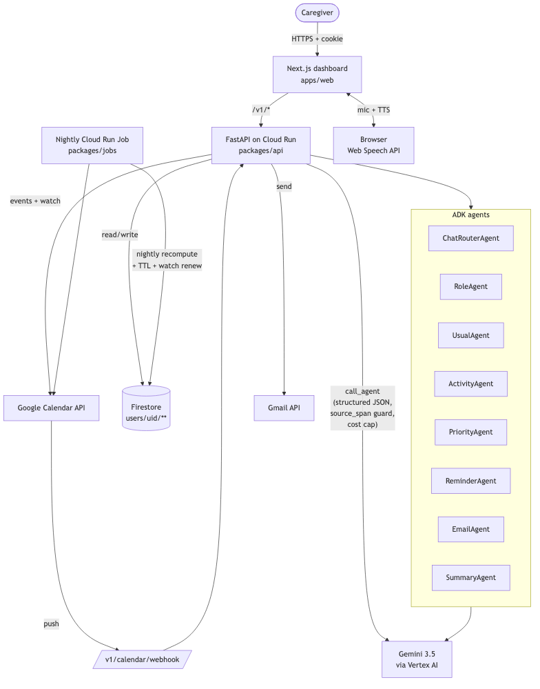

# Level

Caregiver partner for busy parents and multi-generational households.
Level reads your Google Calendar, learns which humans you care for,
notices your usual weekly rhythm, tracks your priorities, drafts
school emails, generates a weekly recap video, and speaks a short
summary of your day.

Built for the [All Things Agentic Hackathon](https://allthingsagentichackathon.devpost.com/)
in the **Collaborative Partner** track.

## Stack (hackathon mandatory checklist)

- **Gemini 3.5 (Pro + Flash)** via AI Studio or Vertex AI - every LLM
  call goes through `packages/core/src/level_core/agents/base.py::call_agent`.
- **Google Agent Development Kit (ADK)** on the hot path: set
  `LEVEL_ADK_MODE=true` and every email + booking intent is planned by
  a `google.adk.LlmAgent`. Planner audit rows carry a `parent_audit_id`
  so `/admin/traces` renders a real waterfall.
- **Google Cloud** - Cloud Run (API), Cloud Run Jobs (nightly),
  Firestore (state), Vertex AI (model host), Secret Manager,
  Cloud Trace (OpenTelemetry), Cloud Scheduler, Gmail API, Calendar API.

## Bonus Google models integrated

- **Gemma 3** as a tier-3 extraction fallback when both AI Studio 3.5
  and Vertex 2.5 return 429. See `agents/base.py::_try_gemma`.
- **Veo 3** for the weekly recap video on `/about`. Cached per ISO
  week per user; disable with `LEVEL_MEDIA_ENABLED=false`.
- **Lyria** for a calm/hopeful/energetic chime around "Hear my day".

## Architecture



Full walkthrough of state, lifecycle, security, scalability, and
performance in [docs/STATE_AND_LIFECYCLE.md](docs/STATE_AND_LIFECYCLE.md).

The mermaid source is at [`docs/architecture.mmd`](docs/architecture.mmd).

## What's inside

- **11 registered agents**, all discoverable via
  `packages/core/src/level_core/agents/registry.py` and
  `GET /v1/admin/agents`.
- **Model Armor** prompt-injection prefilter runs BEFORE every LLM call
  (`agents/model_armor.py`).
- **Signed Agent Identity** in every audit row (HMAC-SHA256 of
  name|version|prompt_hash); verify with `GET /v1/admin/agents/verify`.
- **O(1) rate + cost gate**: hot counter under
  `profile["_gate_counters"]` replaces the O(N) `ai_audit` scan.
- **Multi-turn refinement** (`max_turns`) actually enforced: generator
  agents get 3 turns to produce a schema-valid, source_span-verified
  response before we log `loop_broken=True`.
- **Memory Bank**: long-lived facts persisted from `verdict=keep`
  feedback, injected into generator prompts.
- **Feedback chips** (keep / adjust / not-me) below every AI artifact
  in chat write to `/v1/feedback` and adapt the next agent call.
- **SSE-chunked replies** on `/v1/chat/stream`; the frontend renders
  ~64-char chunks with a blinking caret. Same agent pipeline serves
  the sync and SSE routes; streaming is a UI adapter, not a separate
  model path.
- **Trace waterfall** at `/admin/traces` grouped by `trace_id` with
  expandable JSON.
- **Proactive nudges**: nightly job detects missing usuals and stashes
  suggestion cards. Users see "Level noticed while you slept" on
  `/today`.

## 60-second local start

Prereqs: `node >= 20`, `python >= 3.12`, and [`uv`](https://docs.astral.sh/uv/)
(one-line install: `brew install uv` or
`curl -LsSf https://astral.sh/uv/install.sh | sh`).

```bash
cp .env.example .env
# Fill in GOOGLE_OAUTH_CLIENT_ID + GOOGLE_OAUTH_CLIENT_SECRET
# (see SETUP.md for OAuth consent-screen instructions).

make install
make dev
# API on http://127.0.0.1:8080, web on http://127.0.0.1:3000
```

Open `http://127.0.0.1:3000`, click **Connect Google**, and Level will
start syncing your calendar. `LEVEL_ENV=local` writes state to
`.level/local_store/` — no GCP-side state needed.

Want a rich calendar without hand-populating one? Import one of the
fixture calendars in [`example-data/`](example-data) into a scratch
Google account, then connect that account:

- [`example-data/caregiver-month.ics`](example-data/caregiver-month.ics)
  — two-parent family (Josh + Alex + Nova + Theo + Helen). Two usuals
  are engineered to be missing in the current demo week so the
  proactive-cards job has something to surface.
- [`example-data/caregiver-month-solo.ics`](example-data/caregiver-month-solo.ics)
  — single caregiver, same kids and same elder-care parent, no
  co-parent anywhere.

## Environment knobs

| Env var                        | Default            | Purpose |
|--------------------------------|--------------------|---------|
| `LEVEL_ENV`                    | `local`            | `local` for JSON store, `cloud` for Firestore |
| `LEVEL_MODEL_PRO`              | `gemini-3.5-flash` | Model alias for generator agents |
| `LEVEL_MODEL_FLASH`            | `gemini-3.5-flash` | Model alias for extractor agents |
| `LEVEL_MODEL_GEMMA`            | `gemma-3-4b-it`    | Tier-3 extraction fallback |
| `LEVEL_ADK_MODE`               | `false`            | Route email + book intents through ADK LlmAgent |
| `LEVEL_MEDIA_ENABLED`          | `false`            | Enable Veo + Lyria endpoints |
| `LEVEL_MODEL_VEO`              | `veo-3.0-generate-preview` | Weekly recap video model |
| `LEVEL_MODEL_LYRIA`            | `lyria-002`        | Hear-my-day chime model |
| `LEVEL_DAILY_COST_CAP_USD`     | `2.00`             | Per-user daily cap for downstream agents |
| `LEVEL_ROUTER_COST_CAP_MULTIPLIER` | `3.0`          | Softer cap for the exempt ChatRouterAgent |
| `LEVEL_USER_RATE_PER_HOUR`     | `60`               | Hourly call cap per user |
| `LEVEL_USER_RATE_PER_DAY`      | `500`              | Daily call cap per user |

## Cloud deploy

See [SETUP.md](SETUP.md). One-liner once terraform is applied:

```bash
make deploy-api && make deploy-jobs
```

## Test

```bash
make test          # unit + security + e2e (all offline)
make test-e2e-web  # Playwright smoke against local dev
```

Coverage target: 85% on `packages/core`, 75% on `packages/api`.

## Hackathon submission

See [SUBMISSION.md](SUBMISSION.md) for the rubric mapping, agent list,
demo video plan, and judge access instructions.

## Repo layout

```
apps/web                    Next.js 15 dashboard
packages/api                FastAPI (Cloud Run)
packages/core               Domain: agents, calendar, care, schedule, email, storage, voice
packages/jobs               Cloud Run Jobs: nightly usuals + TTL + watch + proactive cards
infra/terraform             GCP resources
infra/firestore.rules       Per-user isolation
docs/architecture.mmd       Architecture diagram source
docs/STATE_AND_LIFECYCLE.md State + security + scalability + performance walkthrough
docs/writeup-devto.md       Publish-ready dev.to article
docs/social-post.md         Publish-ready X + LinkedIn drafts
tests/unit                  Fast offline tests
tests/security              Prompt-injection corpus + auth + Firestore rules
tests/e2e                   Full API flow with LEVEL_ENV=local
```

## License

MIT — see [LICENSE](LICENSE).
